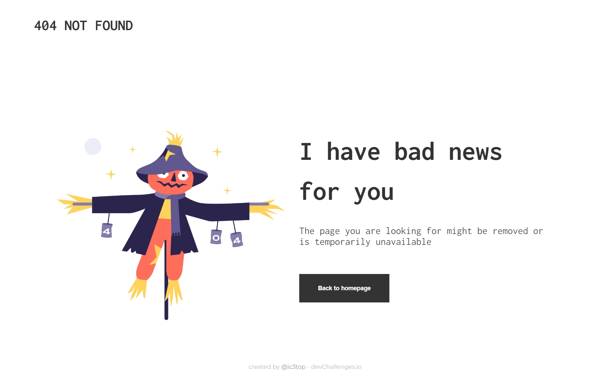

# 404 not found page
> Visit it on [GHpages](https://ic3top.github.io/devChallenges/404-not-found-master/solution/src/)  

## General info
I found this article pritty useful: [Creating a custom 404 page for your GitHub Pages site](https://docs.github.com/en/github/working-with-github-pages/creating-a-custom-404-page-for-your-github-pages-site)  
You can find same FIGMA template [here.](https://www.figma.com/file/QeKWLNhB13zDjJzqR22TKE/404-page-challenge)

## Overview

## Status
Project is: _finished_