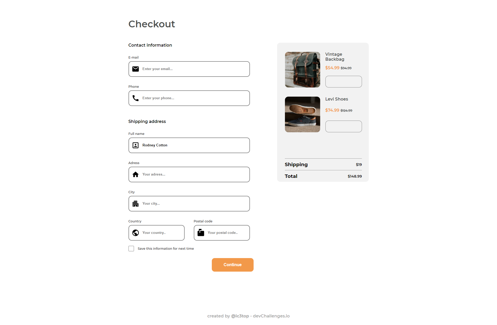
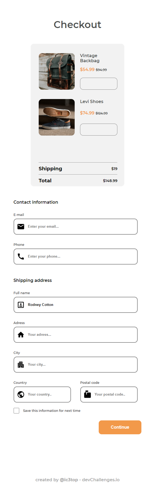

<h1 align="center">Checkout Page</h1>

   Solution for a challenge from  <a href="http://devchallenges.io" target="_blank">Devchallenges.io</a>.

  <h3>
    <a href="https://ic3top.github.io/devChallenges/checkout-page-master/solution/src/index.html">
      Demo
    </a>
     | 
    <a href="https://devchallenges.io/paths/responsive-web-developer/solutions">
      Solution
    </a>
     | 
    <a href="https://devchallenges.io/challenges/0J1NxxGhOUYVqihwegfO">
      Challenge
    </a>
  </h3>

<!-- TABLE OF CONTENTS -->

## Table of Contents

- [Overview](#overview)
  - [Built With](#built-with)
- [Features](#features)
- [ToDo](#todo)

<!-- OVERVIEW -->

## Overview

- View the [live demo](https://ic3top.github.io/devChallenges/checkout-page-master/solution/src/index.html)
- 6rd Dev Challenges project
- Fully adaptive page

### Built With

- [HTML](https://www.w3schools.com/html/)
- [CSS](https://www.w3schools.com/css/)

## Features

- Just a checkout page made with css, without any frameworks.

## Todo

- Make the code well-formatted and replace some css-lines with utility classes.
