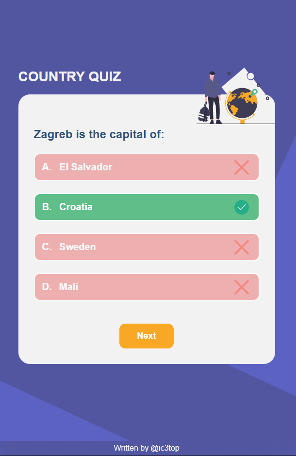
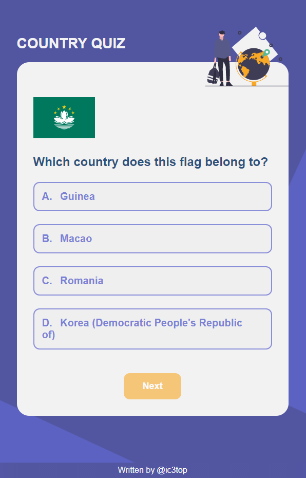

<h1 align="center">Country quiz app</h1>

   Solution for a challenge from  <a href="http://devchallenges.io" target="_blank">Devchallenges.io</a>.

  <h3>
    <a href="https://ic3top.github.io/devChallenges/country-quiz-app/dist/">
      Demo
    </a>
     | 
    <a href="https://devchallenges.io/solutions/j8ssFtGPQpQnzwD5tyNx">
      Solution
    </a>
     | 
    <a href="https://devchallenges.io/challenges/Bu3G2irnaXmfwQ8sZkw8">
      Challenge
    </a>
  </h3>

<!-- TABLE OF CONTENTS -->

## Table of Contents

- [Overview](#overview)
    - [Built With](#built-with)
- [Features](#features)
- [Inspiration](#inspiration)
- [Todos](#Todos)

<!-- OVERVIEW -->

## Overview
Here is a quiz app with two quiz variants which you can choose on the home page. In the first you should choose the right country depending on capital, when in the second depending on a certain flag. 
Try doing your best and answer all the questions right. You will see final results in the end.

- View the [live demo](https://ic3top.github.io/devChallenges/country-quiz-app/dist/)
- 4th Front-end Challenges project

### Built With

- HTML
- CSS
- JS/Vue 3 + Vuex + VueRouter

## Features

- Two quiz variants
- 8 random questions, each has 4 possible answers
- See the correct answer(s)  
- Total results in the end

