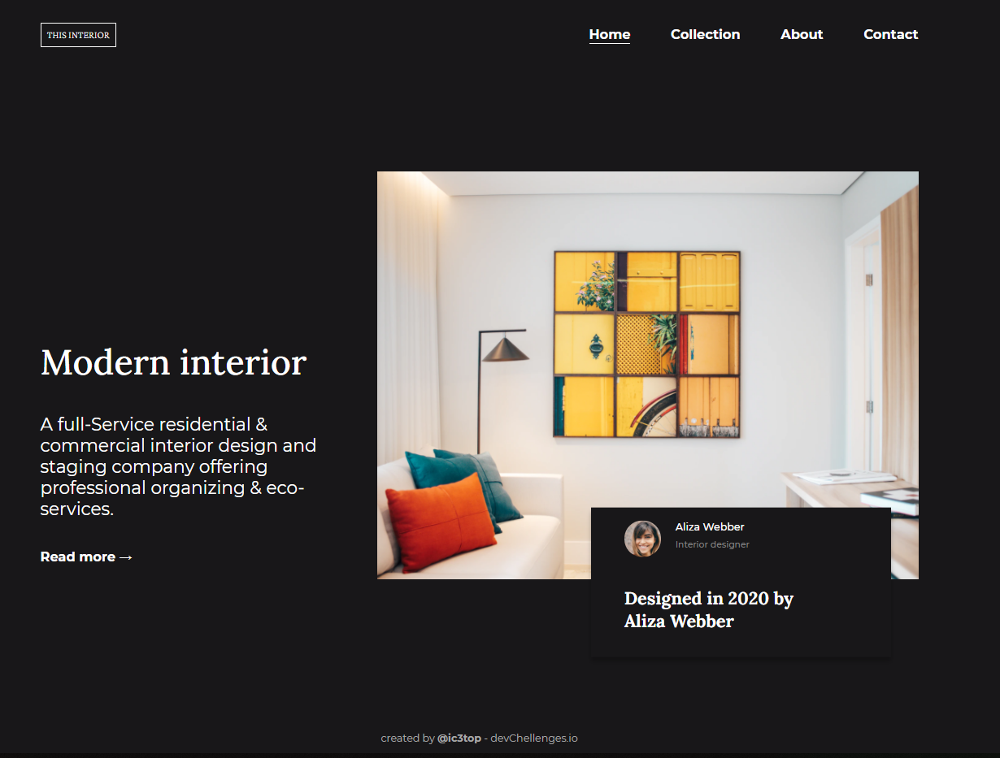

# Interior-consultant
> Visit it on [GHpages](https://ic3top.github.io/devChallenges/interior-consultant-master/solution/src/index.html)

## General info
The feature is that this page has a pretty hamburger menu on viewport < 576px.  
You can find same FIGMA template [here.](https://www.figma.com/file/3cf83hHRBAGjG5EKPcG2bV/interior-consultant-challenge?node-id=1%3A31)  
DevChallenges page of this project [here.](https://devchallenges.io/solutions/6hmzbGcbWNwK6RuFPFbF)

## Overview

## Status
Project is: _finished_