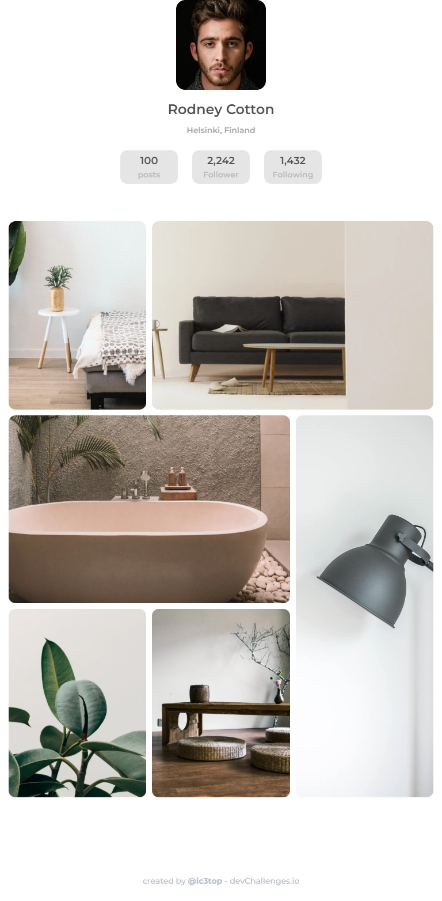

<h1 align="center">Gallery page</h1>

   Solution for a challenge from <a href="http://devchallenges.io" target="_blank">Devchallenges.io</a>.

  <h3>
    <a href="https://ic3top.github.io/devChallenges/my-gallery-master/solution/src/index.html">
      Demo
    </a>
     | 
    <a href="https://devchallenges.io/solutions/xZUDKqpXhFvM7ow048cS">
      Solution
    </a>
     | 
    <a href="https://devchallenges.io/challenges/gcbWLxG6wdennelX7b8I">
      Challenge
    </a>
  </h3>

<!-- TABLE OF CONTENTS -->

## Table of Contents

- [Overview](#overview)
  - [Built With](#built-with)
- [Features](#features)

<!-- OVERVIEW -->

## Overview

- View the [live demo](https://ic3top.github.io/devChallenges/my-gallery-master/solution/src/index.html)
- 5th Dev Challenges project
- Fully adaptive page

### Built With

- HTML
- CSS

### Features

- I used grid to make this page adaptive without media requests

