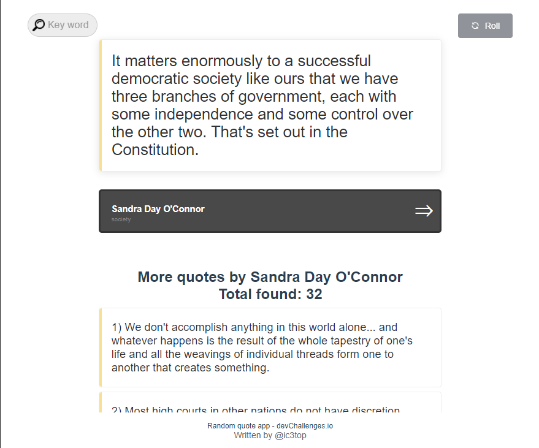

<h1 align="center">Random quote app</h1>

   Solution for a challenge from  <a href="http://devchallenges.io" target="_blank">Devchallenges.io</a>.

  <h3>
    <a href="https://ic3top.github.io/devChallenges/quote-generator/dist/index.html">
      Demo
    </a>
     | 
    <a href="https://devchallenges.io/solutions/8j9M8dewSXsqQcga9e7r">
      Solution
    </a>
     | 
    <a href="https://devchallenges.io/challenges/8Y3J4ucAMQpSnYTwwWW8">
      Challenge
    </a>
  </h3>

<!-- TABLE OF CONTENTS -->

## Table of Contents

- [Overview](#overview)
    - [Built With](#built-with)
- [Features](#features)
- [Todo list](#todos)

<!-- OVERVIEW -->

## Overview
It`s a random quote generator app. During this project I learn lots of new about axios and how easy is it, also I was using Element plus UI(seems like it was unnecessary in such project) second time just for check it out and see how does it go.

- View the [live demo](https://ic3top.github.io/devChallenges/quote-generator/dist/index.html)
- 3rd Front-end Challenges project

### Built With

- HTML
- CSS
- JS/Vue
- Element plus UI library
- axios (for requests to [this API](https://github.com/pprathameshmore/QuoteGarden))

## Feature

- Search for a random quote
- Search for quote by key word  
- Read another quotes from the same author
- Fully adaptive
- Pagination for more than 10 quotes

## Todos

- Search for quotes depending on genre/query/author
