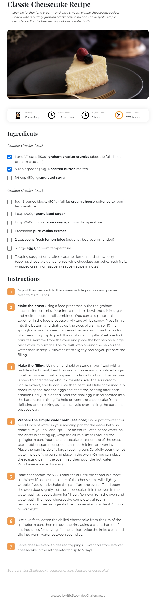

<h1 align="center">Recipe page</h1>

   Solution for a challenge from <a href="http://devchallenges.io" target="_blank">Devchallenges.io</a>.

  <h3>
    <a href="https://ic3top.github.io/devChallenges/recipe-page-master/solution/src/index.html">
      Demo
    </a>
     | 
    <a href="https://devchallenges.io/solutions/rcHmGe9iNbbT0h96LzJF">
      Solution
    </a>
     | 
    <a href="https://devchallenges.io/challenges/OEKdUZ6xs0h99C38XVht">
      Challenge
    </a>
  </h3>

<!-- TABLE OF CONTENTS -->

## Table of Contents

- [Overview](#overview)
  - [Built With](#built-with)
- [Features](#fetures)

<!-- OVERVIEW -->

## Overview

- View the [live demo](https://ic3top.github.io/devChallenges/recipe-page-master/solution/src/index.html)
- 4th Dev Challenges project
- Fully adaptive page

### Built With

- HTML
- CSS
- Bootstrap grid and reboot (v5.0.0-beta2)  

### Features

- Realization of position sticky(I was trying it for the first time)
