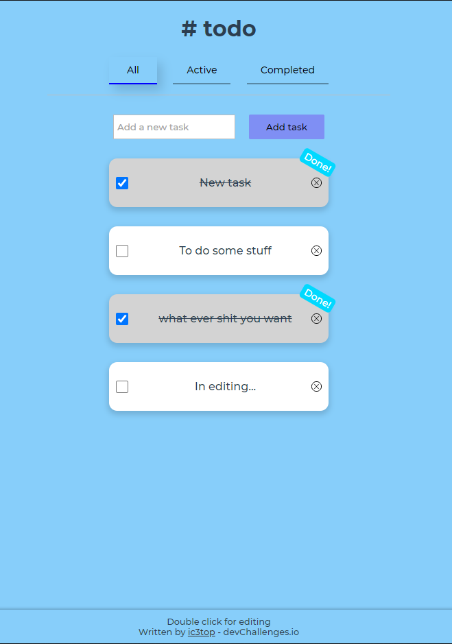

<h1 align="center">Todo app</h1>

   Solution for a challenge from  <a href="http://devchallenges.io" target="_blank">Devchallenges.io</a>.

  <h3>
    <a href="https://ic3top.github.io/devChallenges/todo-app/dist/">
      Demo
    </a>
     | 
    <a href="https://devchallenges.io/solutions/4DA3pLzPNcxTC6uqFFlT">
      Solution
    </a>
     | 
    <a href="https://devchallenges.io/challenges/hH6PbOHBdPm6otzw2De5">
      Challenge
    </a>
  </h3>

<!-- TABLE OF CONTENTS -->

## Table of Contents

- [Overview](#overview)
    - [Built With](#built-with)
- [Features](#features)
- [Inspiration](#inspiration)

<!-- OVERVIEW -->

## Overview
Well, it's a todo app, nothing new. I think I made it a little too complicated because of using Vuex and probably logic that implemented inside.  
All in all, it works great.  

- View the [live demo](https://ic3top.github.io/devChallenges/todo-app/dist/)
- 2nd Front-end Challenges project

### Built With

- HTML
- CSS
- JS/Vue

## Features

- Add new task
- Edit task  
- Complete the task
- Delete any task
- Delete all completed in once
- Sort tasks (All/Active/Completed)
- Tasks are saved into localStorage  
- The app is fully adaptive

## Inspiration
Todo-app is a tradition! 
