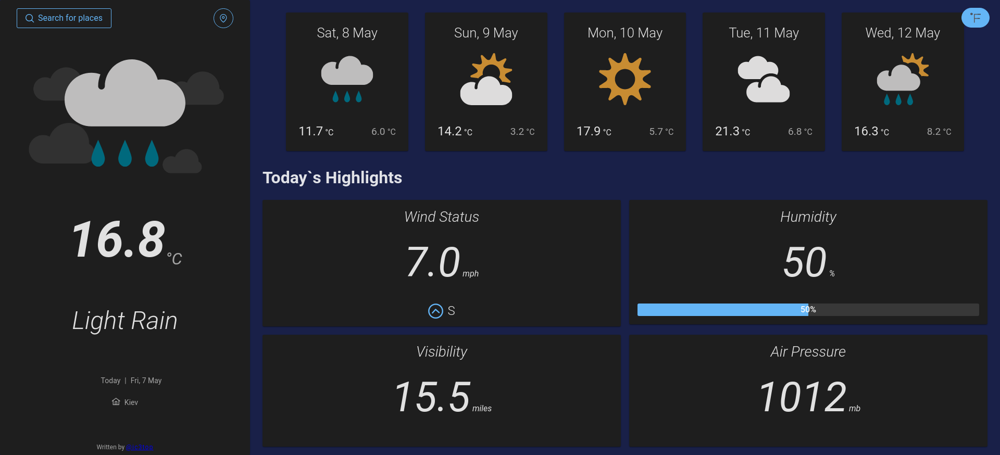

# Weather-app
> A user-friendly app for weather forecasts 

## General info
Another project from devChallenges. For the first time I used a cool UI Component Library PrimeVue and implemented a skeleton loader.
Also working with BOM to get a user geolocation was a new experience.

Take a look at the [Demo page.](https://ic3top.github.io/devChallenges/weather-app/dist/)

## Used technologies
* HTML
* CSS
* JS
* Vue 3 + VueX
* PrimeVue (with its icons, themes)

## Features
* See city weather as default, preferably your current location
* Search for city + autocomplete
* Outputs the weather for today + 5 next days
* See the date and location of the weather
* Image for each type of weather
* See some highlights for today
* Request current location weather (if permissions provided)
* Convert temperature in Celcius to Fahrenheit and vice versa
* Fully adaptive

